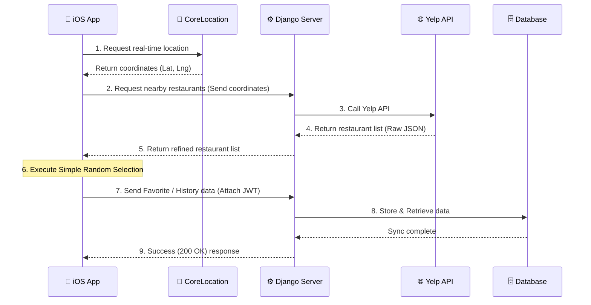

# 🍽️ FoodDigger
> **A location-based random restaurant recommendation service that solves the daily dilemma of "What should I eat today?" in just 1 second.**

<br>
<video src="https://github.com/user-attachments/assets/e0e3010e-9326-4ce0-a64c-27c1b7df1224" width="250" autoplay muted loop></video>

<br>

## 📖 Overview
While there are countless restaurant apps, an overwhelming amount of information often leads to 'decision fatigue'. FoodDigger was designed to eliminate this exact problem. 

By applying a **'Simple Random Selection'** method based on the user's current location, our goal is to provide the most intuitive and fastest restaurant recommendations without the need to overthink.

### ⚙️ System Flow & Key Features
This project is built in a Monorepo environment, separating the frontend (iOS) and backend (Django).
- **Frontend (iOS):** Utilizes `CoreLocation` and `Google Maps SDK` to acquire precise user location data, and transmits the coordinates to the custom backend server via `URLSession`.
- **Backend (Django):** Fetches nearby restaurant data from the `Yelp API` using the coordinates received from the client. Additionally, it implements `JWT` authentication logic through a custom API server to securely manage user personalization features (Favorites, History).

<br>

## 🛠 Tech Stack

### iOS (Frontend)
- **Language:** Swift
- **Framework:** UIKit
- **Architecture:** MVVM-C
- **Network:** URLSession
- **Location & Map:** CoreLocation, Google Maps SDK

### Backend (API Server)
- **Framework:** Python, Django, Django REST Framework (DRF)
- **Database:** SQLite
- **Authentication:** JWT (JSON Web Token)

### External API & Tools
- **API:** Yelp Fusion API
- **Version Control:** Git, GitHub 

<br>

## 📱 Key Features

### 1. 1-Second Random Recommendation
- Sends the user's location coordinates, identified via `CoreLocation`, to the server to fetch nearby restaurant data.
- Instead of complex filtering, it applies a **Simple Random Selection** logic on the client side, providing the most intuitive result view accompanied by smooth animations.

### 2. User Authentication & Token Management (JWT Auth)
- Implemented email-based sign-up and login by integrating with the Django server.
- Applied JWT authentication based on Access/Refresh Tokens, implementing a mechanism to include the token in the Header for all API requests.

### 3. Personal Restaurant Vault (Favorites & History)
- Users can save (Favorite) places they select on the map, or check their favorite restaurants in the history.
- Synchronizes in real-time with the backend DB, providing a consistent user experience across multiple devices.

<br>

## 📐 System Architecture



## 🚀 Getting Started
Instructions for setting up and running this project in a local environment. Since the client (iOS) and server (Django) are separated, both environments need to be configured.

### 1. Prerequisites
The following environment must be installed to clone and run the project.
- **iOS (Frontend):** Xcode 14.0+, iOS 15.0+ 
- **Backend (Server):** Python 3.9+, pip
- **Tools:** Git, GitHub

### 2. Installation & Execution

#### Step 1. Clone the Repository
First, download the project to your local computer.
```bash
git clone https://github.com/averykim/FoodDigger.git
cd FoodDigger
```

#### Step 2. Run the Backend (Django) Server
The backend server must be running first for normal API communication from the app.
```bash
# 1. Navigate to the backend directory
cd Backend

# 2. Create and activate a virtual environment (Mac/Linux)
python -m venv venv
source venv/bin/activate

# 3. Install required packages
pip install -r requirements.txt

# 4. Set up environment variables (.env)
# Create a .env file in the root directory and enter the keys below.
# SECRET_KEY=your_django_secret_key
# YELP_API_KEY=your_yelp_api_key
vi .env 

# 5. DB Migration and Server Run (http://127.0.0.1:8000)
python manage.py migrate
python manage.py runserver
```

#### Step 3. Build & Run iOS Client
With the backend server running, open a new terminal window and execute the following.
```bash
# 1. Navigate to the iOS project directory and open Xcode
cd iOS_App
open FoodDigger.xcodeproj  # Run FoodDigger.xcworkspace if using CocoaPods
```


> Once Xcode is open, press Command + R to build and run the app on the simulator.
